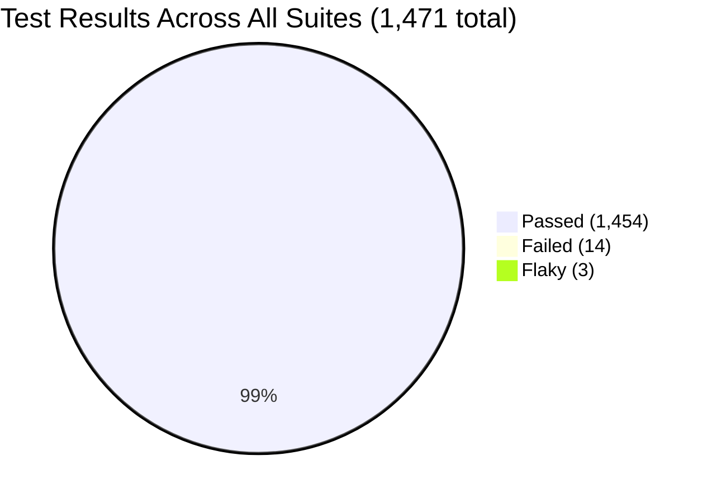
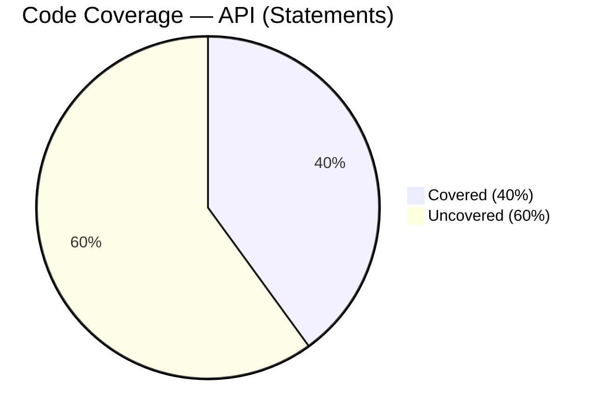
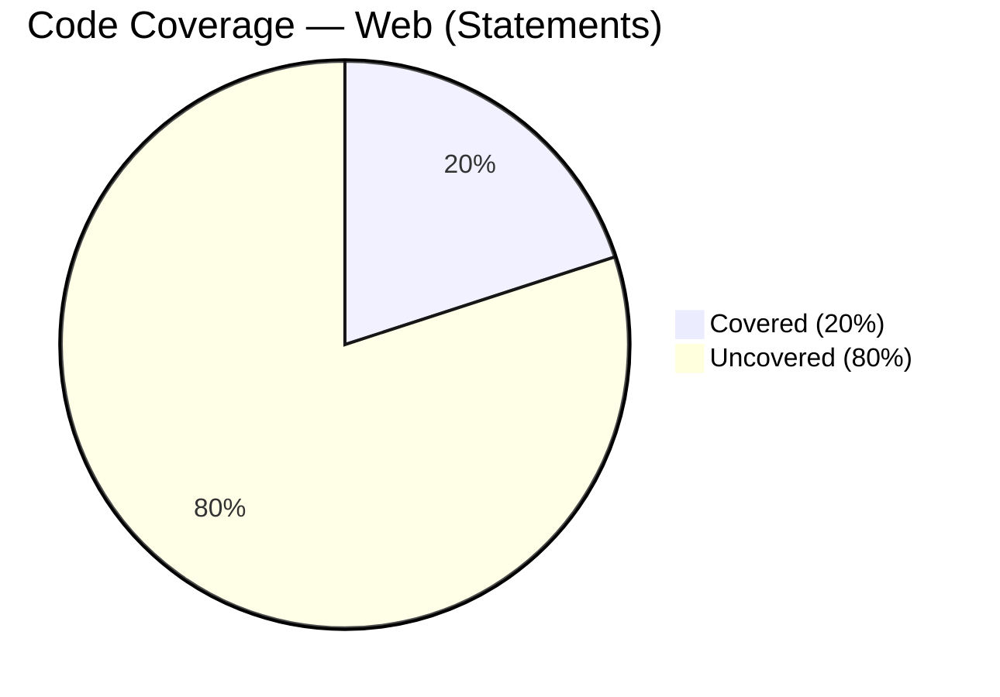
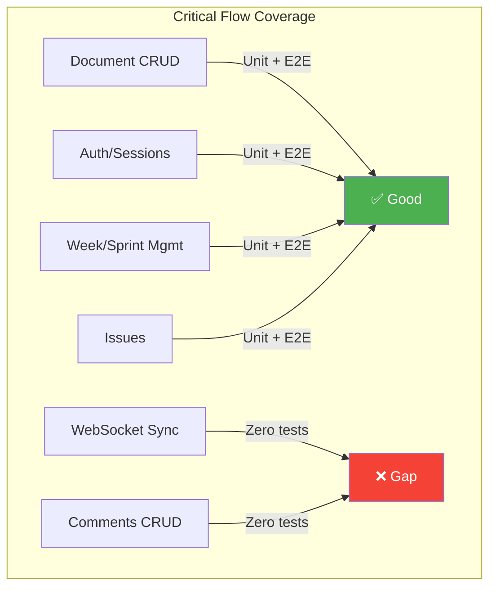

# Test Coverage & Quality Audit

**Date:** 2026-03-10
**Bead:** treasury-ship-jqt
**Branch:** task/jqt-test-coverage-audit

## Methodology

### Tools Used

- **Vitest 4.0.17** with **@vitest/coverage-v8** — unit test runner + V8 coverage for
  `api/` and `web/` packages
- **Playwright 1.x** with **testcontainers** — E2E suite (71 spec files) using
  per-worker PostgreSQL containers for full isolation
- **3x flaky detection** — unit suites run 3 times each; E2E suite has built-in retry
  (`retries: 1`) which identifies flaky tests automatically
- **Manual flow mapping** — cross-referenced critical user flows against E2E spec
  file names and test descriptions

### Commands

```bash
# Unit tests with coverage
pnpm --filter @ship/api test -- --coverage
pnpm --filter @ship/web exec vitest run --coverage

# E2E full suite (4 workers, testcontainers isolation)
TESTCONTAINERS_DOCKER_SOCKET_OVERRIDE=/var/run/docker.sock \
DOCKER_HOST=unix://$HOME/.colima/default/docker.sock \
PLAYWRIGHT_WORKERS=4 npx playwright test --reporter=line

# Flaky detection (unit — manual 3x; E2E — built-in retry)
pnpm --filter @ship/api test -- --run   # x3
pnpm --filter @ship/web test -- --run   # x3
```

### Environment

| Property | Value |
|----------|-------|
| Node.js | v20.20.1 |
| Vitest | 4.0.17 |
| Playwright | testcontainers + Chromium |
| Coverage | @vitest/coverage-v8 |
| OS | macOS Darwin 25.3.0 (aarch64) |
| Docker | Colima + Docker Engine 29.3.0 |

---

## Audit Deliverable

| Metric | Your Baseline |
|--------|---------------|
| Total tests | 1,471 (451 API unit + 151 web unit + 869 E2E) |
| Pass / Fail / Flaky | 1,454 / 14 / 3 |
| Suite runtime | API: 11.5s, Web: 1.1s, E2E: 8.9min |
| Critical flows with zero coverage | See [Critical Flow Mapping](#critical-user-flow-mapping) |
| Code coverage % | web: 19.5% / api: 40.3% |

---

## Suite Summary

| Suite | Files | Tests | Passed | Failed | Flaky | Runtime |
|-------|-------|-------|--------|--------|-------|---------|
| API unit (Vitest) | 28 | 451 | 451 | 0 | 0 | ~11.5s |
| Web unit (Vitest) | 16 | 151 | 138 | 13 | 0 | ~1.1s |
| E2E (Playwright) | 71 | 869 | 865 | 1 | 3 | 8.9min |
| **Total** | **115** | **1,471** | **1,454** | **14** | **3** | — |

---

## E2E Test Results

**71 spec files, 869 tests, 865 passed, 1 failed, 3 flaky, 8.9 min (4 workers)**

### Failed (1)

| Test | File | Root Cause |
|------|------|-----------|
| canceling a comment removes the highlight | `inline-comments.spec.ts:118` | Comment cancel doesn't clear highlight styling — likely a real bug in comment-cancel handler |

### Flaky (3 — passed on retry)

| Test | File | Pattern |
|------|------|---------|
| plan edits visible on /my-week after nav | `my-week-stale-data.spec.ts:28` | Stale cache — page doesn't refetch after edit |
| retro edits visible on /my-week after nav | `my-week-stale-data.spec.ts:63` | Same stale cache pattern |
| Allocation grid shows person data | `weekly-accountability.spec.ts:384` | Timing — data not ready on first render |

**Root cause pattern:** All 3 flaky tests involve navigating away from a page where an edit was made, then navigating back and expecting fresh data. This is a cache invalidation timing issue.

---

## Web Unit Tests — 13 Deterministic Failures

**16 files, 151 tests, 138 passed, 13 failed, ~1.1s**

### `document-tabs.test.ts` — 9 failures

Tab configuration was refactored (tab order changed, sprint gained tabs, tab IDs
renamed) but tests were not updated. **Stale tests, not bugs.**

### `DetailsExtension.test.ts` — 3 failures

Extension refactored to use structured content (`detailsSummary detailsContent`)
instead of generic `block+`. Tests assert old structure. **Stale tests, not bugs.**

### `useSessionTimeout.test.ts` — 1 failure

`onTimeout` fires even after dismiss. Likely a race in fake timer handling or dismiss
logic changed. **May be a real bug or stale test — needs investigation.**

---

## API Unit Tests — All Passing

**28 files, 451 tests, 0 failures, ~11.5s**

No issues. Consistently green across all 3 flaky-detection runs.

---

## Flaky Detection (3x Runs)

### Unit Tests

| Suite | Run 1 | Run 2 | Run 3 | Verdict |
|-------|-------|-------|-------|---------|
| API (451 tests) | 451 pass | 451 pass | 451 pass | **Stable** |
| Web (151 tests) | 138 pass, 13 fail | 138 pass, 13 fail | 138 pass, 13 fail | **Stable** (failures are deterministic) |

### E2E Tests

Playwright's built-in retry (`retries: 1`) identified 3 flaky tests (see above).
All other 865 tests passed on first attempt.

**Verdict: No intermittent failures in unit suites. 3 flaky E2E tests — all cache/timing related.**

---

## Code Coverage

### API — 40.3% Statements

| Directory | Stmts | Branch | Funcs | Lines |
|-----------|-------|--------|-------|-------|
| **All files** | **40.34%** | **33.44%** | **40.9%** | **40.52%** |
| src/ (root) | 56.77% | 16.66% | 42.85% | 59.29% |
| src/collaboration/ | 8.53% | 2.42% | 6.52% | 8.83% |
| src/db/ | 57.89% | 50% | 0% | 57.89% |
| src/middleware/ | 77.06% | 72% | 88.88% | 78.3% |
| src/openapi/ | 100% | 100% | 100% | 100% |
| src/routes/ | 36.93% | 32.56% | 42.24% | 37.01% |
| src/services/ | 20.36% | 16.33% | 18.18% | 20.87% |
| src/utils/ | 71.31% | 64.64% | 68.96% | 73.21% |

### Web — 19.5% Statements

| Directory | Stmts | Branch | Funcs | Lines |
|-----------|-------|--------|-------|-------|
| **All files** | **19.46%** | **14.65%** | **18.5%** | **19.78%** |
| components/ | 28.31% | 22.03% | 22.64% | 31.08% |
| components/editor/ | 4.09% | 1.77% | 8.62% | 4.29% |
| components/icons/uswds/ | 48.27% | 18.75% | 40% | 53.84% |
| components/ui/ | 94.73% | 57.14% | 100% | 100% |
| contexts/ | 43.75% | 44.44% | 33.33% | 47.72% |
| hooks/ | 49.7% | 32.95% | 72% | 47.79% |
| lib/ | 15.31% | 15.49% | 8.33% | 14.5% |

---

## Critical User Flow Mapping

Mapped critical user flows (from assignment: document CRUD, real-time sync, auth,
sprint management) against existing test coverage.

### Document CRUD

| Flow | Unit Tests | E2E Tests | Coverage |
|------|-----------|-----------|----------|
| Create document | `documents.test.ts` | `documents.spec.ts`, `debug-create.spec.ts` | **Good** |
| Read/list documents | `documents.test.ts`, `documents-visibility.test.ts` | `documents.spec.ts`, `docs-mode.spec.ts` | **Good** |
| Update document content | `api-content-preservation.test.ts` | `document-workflows.spec.ts` | **Good** |
| Delete document | — | `documents.spec.ts` | **E2E only** |
| Document properties | — | `wiki-document-properties.spec.ts` | **E2E only** |
| Document associations | `associations-regression.test.ts` | `backlinks.spec.ts` | **Partial** |

### Real-time Sync / Collaboration

| Flow | Unit Tests | E2E Tests | Coverage |
|------|-----------|-----------|----------|
| Yjs state persistence | `collaboration.test.ts` | — | **Unit only, 8.5% coverage** |
| WebSocket sync protocol | — | — | **Zero coverage** |
| Conflict resolution (CRDT) | — | — | **Zero coverage** |
| Content preservation on API save | `api-content-preservation.test.ts` | — | **Unit only** |

### Authentication

| Flow | Unit Tests | E2E Tests | Coverage |
|------|-----------|-----------|----------|
| Login/logout | `auth.test.ts` (routes + middleware) | `auth.spec.ts`, `security.spec.ts` | **Good** |
| Session timeout | `useSessionTimeout.test.ts` (1 failing) | `session-timeout.spec.ts` | **Good** (but 1 unit bug) |
| Workspace auth/isolation | `workspaces.test.ts` | `workspaces.spec.ts`, `authorization.spec.ts` | **Good** |
| API token auth | `api-tokens.test.ts` | — | **Unit only** |

### Sprint/Week Management

| Flow | Unit Tests | E2E Tests | Coverage |
|------|-----------|-----------|----------|
| Week CRUD | `weeks.test.ts` (41 tests) | `weeks.spec.ts`, `project-weeks.spec.ts` | **Good** |
| Sprint reviews | `sprint-reviews.test.ts` | — | **Unit only** |
| Weekly accountability | `accountability.test.ts` | `weekly-accountability.spec.ts`, `accountability-*.spec.ts` | **Good** |
| Sprint planning/timeline | — | `program-mode-week-ux.spec.ts` (66 tests) | **E2E only, thorough** |

### Issues

| Flow | Unit Tests | E2E Tests | Coverage |
|------|-----------|-----------|----------|
| Issue CRUD | `issues.test.ts` | `issues.spec.ts` | **Good** |
| Issue history | `issues-history.test.ts` | — | **Unit only** |
| Bulk operations | — | `issues-bulk-operations.spec.ts`, `bulk-selection.spec.ts` | **E2E only** |
| Issue display IDs | — | `issue-display-id.spec.ts` | **E2E only** |

### Flows With Zero Test Coverage

| Flow | Risk |
|------|------|
| **WebSocket sync protocol** | High — core feature, no tests at all |
| **CRDT conflict resolution** | High — data integrity risk |
| **Comments CRUD** | Medium — `comments.ts` route has no unit or E2E tests |
| **AI analysis** | Low — `ai.ts`, `ai-analysis.ts` untested |
| **Admin operations** | Low — `admin.ts`, `admin-credentials.ts` untested |
| **Feedback** | Low — `feedback.ts` untested |
| **CAIA auth** | Low — `caia-auth.ts` untested |

---

## Severity Rankings

| # | Finding | Severity | Impact |
|---|---------|----------|--------|
| 1 | 13 deterministically failing web unit tests | **P1 — High** | Broken CI signal; masks real regressions |
| 2 | WebSocket sync + CRDT conflict resolution: zero coverage | **P1 — High** | Core collaboration feature has no safety net |
| 3 | 3 flaky E2E tests (cache invalidation) | **P2 — Medium** | Unreliable CI, developer friction |
| 4 | 1 E2E failure (inline-comments highlight) | **P2 — Medium** | Real bug in comment-cancel flow |
| 5 | 40% API / 20% web line coverage | **P2 — Medium** | Large untested surface area |
| 6 | 57% of API routes have no unit tests | **P2 — Medium** | Business logic relies solely on E2E |
| 7 | 86% of API services untested | **P2 — Medium** | Services contain critical logic |
| 8 | Comments route: zero coverage (unit + E2E) | **P2 — Medium** | User-facing feature completely untested |
| 9 | `@vitest/coverage-v8` not in devDependencies | **P3 — Low** | Coverage requires manual install |

---

## Recommendations

1. **Fix the 13 failing web unit tests** — Update `document-tabs.test.ts` (9) for
   current tab config, `DetailsExtension.test.ts` (3) for new content model,
   investigate `useSessionTimeout.test.ts` dismiss behavior.

2. **Add collaboration protocol tests** — The WebSocket sync and CRDT conflict
   resolution paths are the highest-risk zero-coverage area. Even basic
   "two clients edit simultaneously" tests would catch regressions.

3. **Fix the 3 flaky E2E tests** — All are cache invalidation timing. Add explicit
   cache-busting or wait-for-data patterns in the stale-data specs.

4. **Add unit tests for `comments.ts`** — Only route with zero coverage at both
   unit and E2E level despite being user-facing.

5. **Add `@vitest/coverage-v8` to both packages' devDependencies** and configure
   web coverage (done in this branch — see `web/vitest.config.ts`).

---

## Mermaid: Test Health Overview








