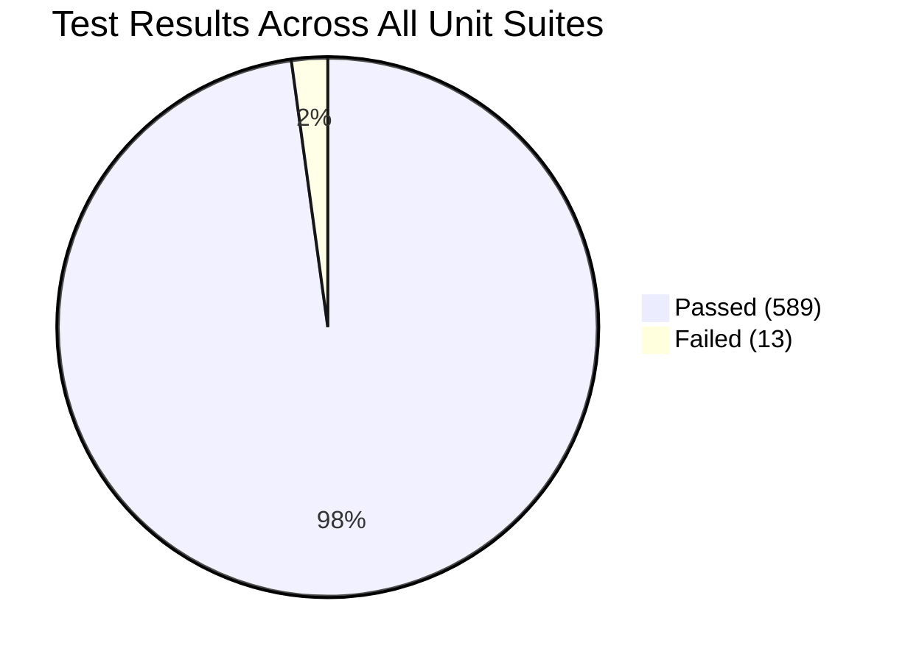
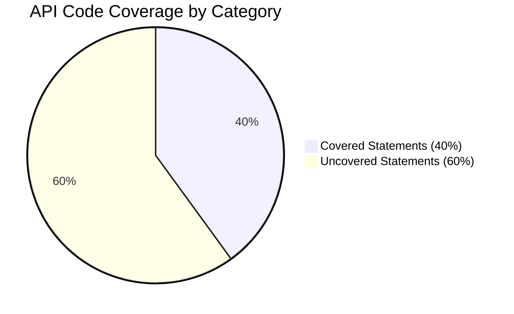
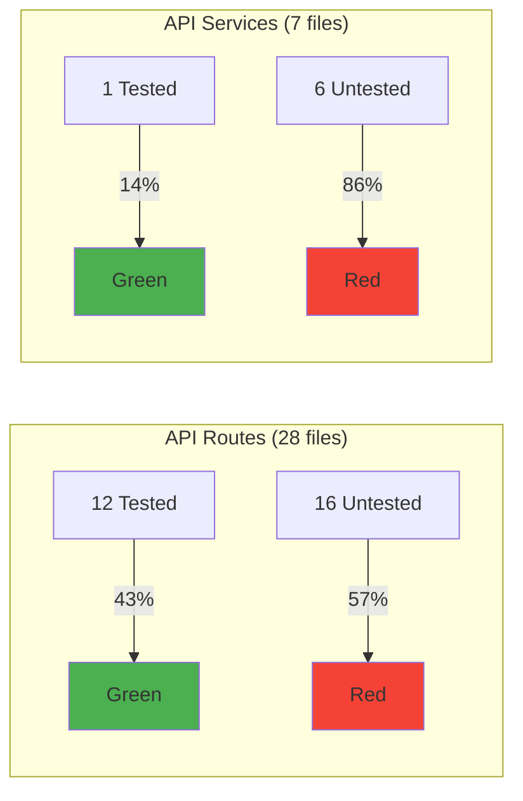

# Test Coverage & Quality Audit

**Date:** 2026-03-10
**Bead:** treasury-ship-jqt
**Branch:** task/jqt-test-coverage-audit

## Methodology

### Tools Used

- **Vitest 4.0.17** — unit test runner for both `api/` and `web/` packages
- **@vitest/coverage-v8** — V8-based code coverage provider
- **3x flaky detection** — each suite run 3 times to identify non-deterministic tests
- **Manual inventory** — cross-referenced source files against test files for coverage gaps

### Commands

```bash
# API unit tests with coverage
pnpm --filter @ship/api test -- --coverage

# Web unit tests
pnpm --filter @ship/web test -- --run

# Flaky detection (repeat 3x, compare results)
pnpm --filter @ship/api test -- --run   # x3
pnpm --filter @ship/web test -- --run   # x3
```

### Environment

| Property | Value |
|----------|-------|
| Node.js | v20.20.1 |
| Vitest | 4.0.17 |
| Coverage | @vitest/coverage-v8 |
| OS | macOS Darwin 25.3.0 |

---

## Suite Summary

| Suite | Files | Tests | Passed | Failed | Runtime |
|-------|-------|-------|--------|--------|---------|
| API unit | 28 | 451 | 451 | 0 | ~11.5s |
| Web unit | 16 | 151 | 138 | 13 | ~1.1s |
| E2E (Playwright) | 71 | ~882 | Not run* | — | — |
| **Total** | **115** | **~1,484** | — | **13** | — |

*E2E tests not run in this audit — they require a live dev server and are covered by the `/e2e-test-runner` workflow. Count is from `test(` occurrences in spec files.

---

## API Unit Tests — All Passing

**28 test files, 451 tests, 0 failures, ~11.5s runtime**

| Test File | Tests | Time |
|-----------|-------|------|
| weeks.test.ts | 41 | 402ms |
| extractHypothesis.test.ts | 36 | 72ms |
| collaboration.test.ts | 30 | 117ms |
| business-days.test.ts | 27 | 76ms |
| workspaces.test.ts | 25 | 247ms |
| documents.test.ts | 19 | 305ms |
| documents-visibility.test.ts | 21 | 276ms |
| api-content-preservation.test.ts | 18 | 112ms |
| standups.test.ts | 17 | 232ms |
| backlinks.test.ts | 17 | 264ms |
| auth.test.ts (routes) | 16 | 950ms |
| auth.test.ts (middleware) | 15 | 86ms |
| projects.test.ts | 14 | 111ms |
| activity.test.ts | 13 | 122ms |
| accountability.test.ts | 13 | 73ms |
| associations-regression.test.ts | 12 | 247ms |
| issues-history.test.ts | 12 | 103ms |
| issues.test.ts | 21 | 216ms |
| transformIssueLinks.test.ts | 21 | 74ms |
| search.test.ts | 11 | 126ms |
| project-retros.test.ts | 11 | 222ms |
| sprint-reviews.test.ts | 10 | 241ms |
| reports-to.test.ts | 7 | 198ms |
| files.test.ts | 7 | 169ms |
| iterations.test.ts | 7 | 108ms |
| circular-reference.test.ts | 5 | 92ms |
| api-tokens.test.ts | 4 | 90ms |
| health.test.ts | 1 | 102ms |

---

## Web Unit Tests — 13 Failures

**16 test files, 151 tests, 138 passed, 13 failed, ~1.1s runtime**

### Failing Tests

**`document-tabs.test.ts` — 9 failures**

| Test | Root Cause |
|------|-----------|
| returns tabs for project documents | Tests expect old tab config (e.g. `details` first tab); code now has `issues` first |
| returns tabs for program documents | Same — tab ordering changed |
| returns empty array for sprint documents | Sprint now has tabs, test expects none |
| returns false for sprint documents | Sprint `hasTabs` changed |
| validates project tab IDs correctly | Expects `details` as first tab, now `issues` |
| validates program tab IDs correctly | Same pattern |
| returns first tab as default for URL without tab | Expects `details`, gets `issues` |
| resolves dynamic labels with counts | Looks for `sprints` tab that no longer exists by that ID |
| resolves dynamic labels without counts | Same |

**Root cause:** Tab configuration in `document-tabs.ts` was refactored (tab order changed, sprint gained tabs, tab IDs renamed) but tests were not updated. **These are stale tests, not bugs.**

**`useSessionTimeout.test.ts` — 1 failure**

| Test | Root Cause |
|------|-----------|
| does NOT call onTimeout if dismissed before 0 | Timer fires `onTimeout` even after dismiss. Likely a race in fake timer handling or dismiss logic changed. |

**`DetailsExtension.test.ts` — 3 failures**

| Test | Root Cause |
|------|-----------|
| should be configured as a block node with content | Expects `content: 'block+'`, actual is `'detailsSummary detailsContent'` — extension was refactored to use named child nodes |
| should work in editor context | Schema creation fails due to unresolved `detailsSummary` node type |
| should allow inserting details via command | Same schema error |

**Root cause:** `DetailsExtension` was refactored to use structured content (`detailsSummary detailsContent`) instead of generic `block+`, but tests still assert old structure.

---

## Code Coverage (API)

| Directory | Stmts | Branch | Funcs | Lines |
|-----------|-------|--------|-------|-------|
| **All files** | **40.34%** | **33.44%** | **40.9%** | **40.52%** |
| src/ (root) | 56.77% | 16.66% | 42.85% | 59.29% |
| src/collaboration/ | 8.53% | 2.42% | 6.52% | 8.83% |
| src/db/ | 57.89% | 50% | 0% | 57.89% |
| src/middleware/ | 77.06% | 72% | 88.88% | 78.3% |
| src/openapi/ | 100% | 100% | 100% | 100% |
| src/routes/ | 36.93% | 32.56% | 42.24% | 37.01% |
| src/services/ | 20.36% | 16.33% | 18.18% | 20.87% |
| src/utils/ | 71.31% | 64.64% | 68.96% | 73.21% |

**Web coverage:** Not measured — `@vitest/coverage-v8` not configured for web package.

---

## Coverage Gap Analysis

### API Routes Without Unit Tests

| Route File | Notes |
|------------|-------|
| accountability.ts | No direct test (tested via E2E) |
| activity.ts | Has test (activity.test.ts) |
| admin-credentials.ts | No test |
| admin.ts | No test |
| ai.ts | No test |
| associations.ts | Regression test exists, no full test |
| caia-auth.ts | No test |
| claude.ts | No test |
| comments.ts | No test |
| dashboard.ts | No test |
| feedback.ts | No test |
| invites.ts | No test |
| programs.ts | No test |
| setup.ts | No test |
| team.ts | No test |
| weekly-plans.ts | No test |

**16 of 28 route files have no direct unit tests** (57% untested routes).

### API Services Without Unit Tests

| Service File | Notes |
|------------|-------|
| ai-analysis.ts | No test |
| audit.ts | No test |
| caia.ts | No test |
| invite-acceptance.ts | No test |
| oauth-state.ts | No test |
| secrets-manager.ts | No test |

**6 of 7 service files have no unit tests** (only `accountability.ts` is tested).

### Collaboration Module

Coverage is **8.53% statements** — the main WebSocket collaboration server and Yjs persistence layer are almost entirely untested at the unit level. The existing tests (`collaboration.test.ts`, `api-content-preservation.test.ts`) cover API-facing behavior but not the sync protocol internals.

---

## Flaky Detection (3x Runs)

### API Suite

| Run | Files | Tests | Passed | Failed | Runtime |
|-----|-------|-------|--------|--------|---------|
| 1 | 28 | 451 | 451 | 0 | 11.64s |
| 2 | 28 | 451 | 451 | 0 | 11.44s |
| 3 | 28 | 451 | 451 | 0 | 11.58s |

**Result: No flaky tests detected.** All 451 tests passed consistently across 3 runs.

### Web Suite

| Run | Files | Tests | Passed | Failed | Runtime |
|-----|-------|-------|--------|--------|---------|
| 1 | 16 | 151 | 138 | 13 | 1.06s |
| 2 | 16 | 151 | 138 | 13 | 1.06s |
| 3 | 16 | 151 | 138 | 13 | 1.06s |

**Result: No flaky tests detected.** The same 13 tests fail deterministically every run — they are stale, not flaky.

---

## Severity Rankings

| Finding | Severity | Impact |
|---------|----------|--------|
| 13 deterministically failing web tests | **P1 — High** | Broken CI signal; masks real regressions |
| 40% API line coverage | **P2 — Medium** | Low confidence in untested code paths |
| 57% of API routes untested | **P2 — Medium** | Core business logic has no safety net |
| 86% of services untested | **P2 — Medium** | Services contain critical business logic |
| 8.5% collaboration coverage | **P2 — Medium** | Real-time collab is a core feature |
| No web coverage measurement | **P3 — Low** | Can't track web-side regression risk |
| `@vitest/coverage-v8` not in deps | **P3 — Low** | Coverage requires manual install |

---

## Recommendations

1. **Fix the 13 failing web tests** — Update `document-tabs.test.ts` (9 tests) to match current tab config, fix `DetailsExtension.test.ts` (3 tests) for new content model, investigate `useSessionTimeout.test.ts` dismiss race.

2. **Add unit tests for critical untested routes** — Priority: `comments.ts`, `associations.ts`, `programs.ts`, `invites.ts`, `dashboard.ts` (user-facing, high-traffic).

3. **Add coverage config to web vitest** — Mirror the API config to get visibility into frontend test coverage.

4. **Improve collaboration test coverage** — The 8.5% coverage on the most complex subsystem is a risk. Focus on Yjs persistence and conflict resolution paths.

5. **Add `@vitest/coverage-v8` to API devDependencies** — Currently not in `package.json`; coverage requires manual install.

---

## Mermaid: Test Health Overview






